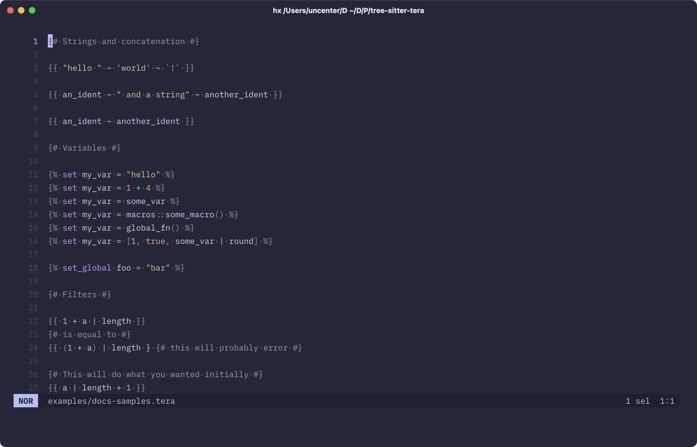
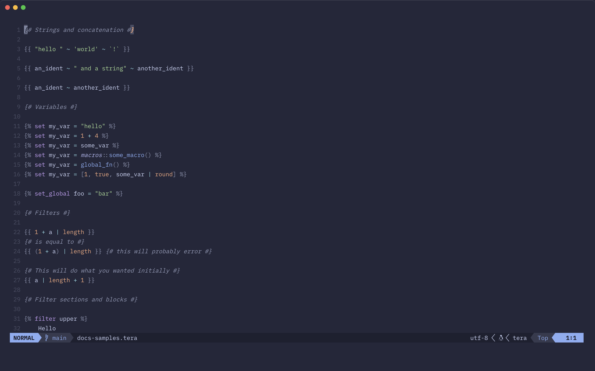

# tree-sitter-tera

[Tree-sitter](https://tree-sitter.github.io/tree-sitter/) grammar and syntax highlight queries for the [Tera](https://keats.github.io/tera/) templating language.

[](./assets/helix.png)

_Helix with tree-sitter-tera. Screenshot taken with the [catppuccin/helix](https://github.com/catppuccin/helix) theme._

[](./assets/neovim.png)

_Neovim with tree-sitter-tera. Screenshot taken with the [catppuccin/nvim](https://github.com/catppuccin/nvim) theme._

## Usage

### Helix

1. Add the following language and grammar configuration to your own [`languages.toml` configuration file](https://docs.helix-editor.com/configuration.html):

```toml
[[grammar]]
name = "tera"

[grammar.source]
git = "https://github.com/uncenter/tree-sitter-tera"
rev = "main"

[[language]]
file-types = ["tera"]
grammar = "tera"
injection-regex = "tera"
name = "tera"
scope = "source.tera"
block-comment-tokens = [
  { start = "{#", end = "#}" },
  { start = "{#-", end = "-#}" },
  { start = "{#", end = "-#}" },
  { start = "{#-", end = "#}" },
]

[language.auto-pairs]
"\"" = "\""
"'" = "'"
"`" = "`"
"(" = ")"
"[" = "]"
"{" = "}"
"%" = "%"
```

2. Run `hx --grammar fetch` to fetch the grammar from this repository, and then `hx --grammar build` to build the grammars.
3. Run `just helix sync` or `just helix link` to copy or symlink the [Helix-specific queries](./helix-queries) to Helix's runtime directory, as unfortunately [queries are not used from the grammar repository by default](https://github.com/helix-editor/helix/discussions/11379#discussioncomment-10194806).

> [!IMPORTANT]
> Helix [uses the reverse query precedence ordering](https://github.com/helix-editor/helix/issues/9436), meaning that the _first_ matching highlight query is used rather than last; this is the opposite behavior of Neovim and Zed, both of which use the _last_ matching highlight query - think of it like CSS, where queries gain precedence by being located further down. Helix does seemingly plan to change this soon, but for now this repository has a separate folder for Helix-converted queries (built with `just helix build`, using [tree-sitter-query-reverser](https://github.com/uncenter/tree-sitter-query-reverser).

### Neovim

#### Lazy.nvim

Extend your nvim-treesitter plugin with this Tera plugin.

```lua
{
    "nvim-treesitter/nvim-treesitter",
    config = function()
        -- setup treesitter with config
    end,
    dependencies = {
        ...
        { "uncenter/tree-sitter-tera", build = ":TSUpdate tera" },
        ...
    },
    build = ":TSUpdate",
},
```

#### Manual

```lua
local parser_config = require("nvim-treesitter.parsers").get_parser_configs()

parser_config.tera = {
  install_info = {
    url = "https://github.com/uncenter/tree-sitter-tera",
    files = { "src/parser.c" },
    branch = "main",
  },
  filetype = "tera",
}
```

Run `:TSInstall tera` in Neovim to install the above parser.

## License

[MIT](LICENSE)
