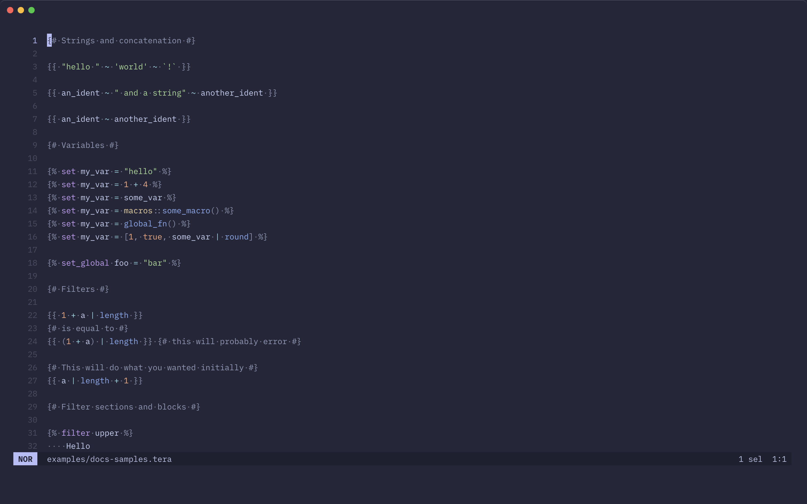

# tree-sitter-tera

[Tree-sitter](https://tree-sitter.github.io/tree-sitter/) grammar and syntax highlight queries for the [Tera](https://keats.github.io/tera/) templating language.

## Usage

### Helix



1. Add the sample language and grammar configuration for Tera from [`languages.toml`](./languages.toml) to your own [`languages.toml` configuration file](https://docs.helix-editor.com/configuration.html).
2. Run `hx --grammar fetch` to fetch the grammar from this repository, and then `hx --grammar build` to build the grammars.
3. Run `just helix sync` or `just helix link` to copy or symlink the [queries](./queries) to Helix's runtime directory, as unfortunately [queries are not used from the grammar repository by default](https://github.com/helix-editor/helix/discussions/11379#discussioncomment-10194806).

> [!TIP]
> See https://docs.helix-editor.com/guides/adding_languages.html for more details.

### Neovim


#### Lazy.nvim

Extend your nvim-treesitter plugin with this Tera plugin.

```lua
{
    "nvim-treesitter/nvim-treesitter",
    config = function()
        -- setup treesitter with config
    end,
    dependencies = {
        ...
        { "uncenter/tree-sitter-tera", build = ":TSUpdate tera" },
        ...
    },
    build = ":TSUpdate",
},
```

#### Manual

```lua
local parser_config = require("nvim-treesitter.parsers").get_parser_configs()

parser_config.tera = {
  install_info = {
    url = "https://github.com/uncenter/tree-sitter-tera",
    files = { "src/parser.c" },
    branch = "main",
  },
  filetype = "tera",
}
```

Run `:TSInstall tera` in Neovim to install the above parser.

## License

[MIT](LICENSE)
